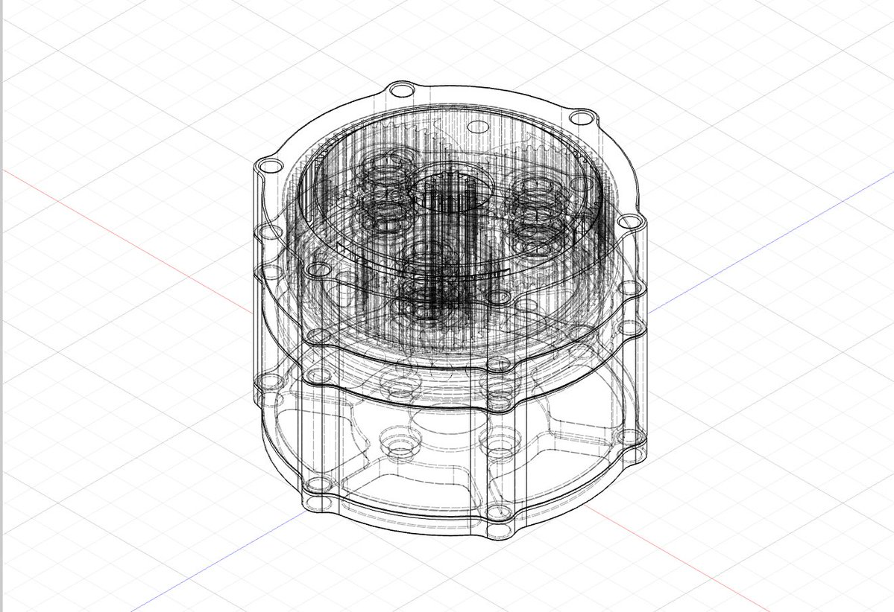
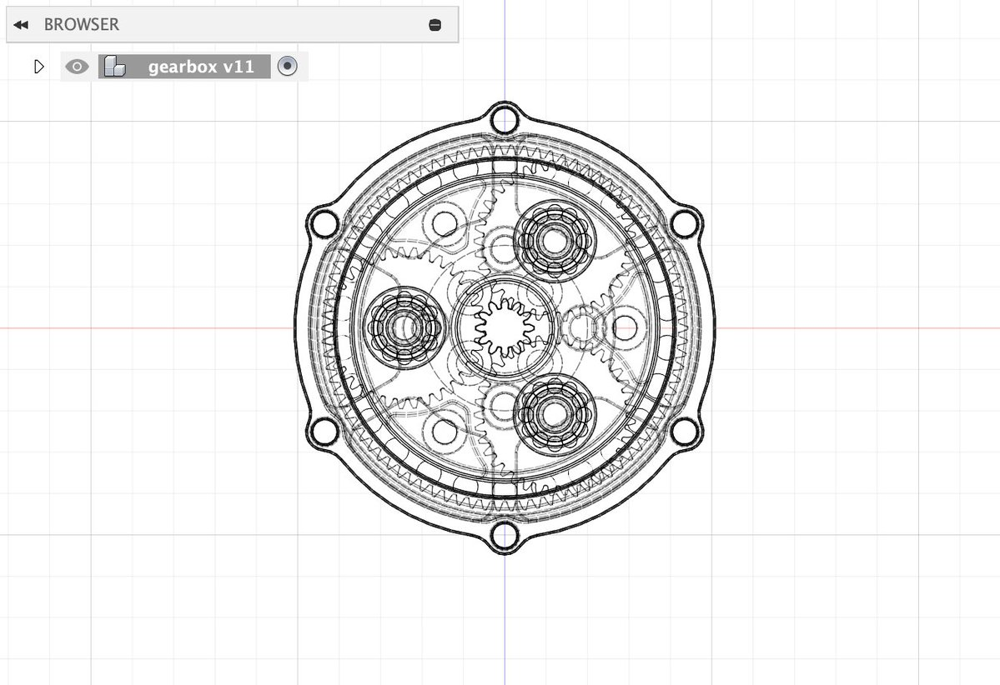

# Planetary Gearbox for 4006 series brushless motor

**My go-to board for servo motor and ESC control** 
This weekend, I brushed up on my CAD skills and designed a compact planetary gearbox for 4006 series brushless DC motors. The entire assembly, including the motor, stands at just 4cm tall and delivers an 8:1 gearing ratio for higher torque and finer position control.

## Usage

materials:
- `ppa-cf filament`
- `4006 series brushless motor`
- `3d printer`
- `m3 bolts`

# Posted on X dot com
[original post with >500 likes and >50,000 views](https://x.com/TheBrianLesko/status/1888679622583464144) 

[video demonstration > 11,000 views](https://x.com/TheBrianLesko/status/1899279842098471001)

## Why such a tiny gearbox

Sure, you ***could*** make a larger gearbox, but why? This one is only 4cm tall.

The 3d model files were made with [Fusion 360](https://www.autodesk.com/products/fusion-360/personal) and exported to stl files for printing.

## 3d Printed Mount 

The print needs high accuracy because this setup is so compact. Its smaller than most 3d printers can make. 

&nbsp;

&nbsp;

╭━━╮╭━━━┳━━┳━━━┳━╮╱╭╮        ╭╮╱╱╭━━━┳━━━┳╮╭━┳━━━╮
┃╭╮┃┃╭━╮┣┫┣┫╭━╮┃┃╰╮┃┃        ┃┃╱╱┃╭━━┫╭━╮┃┃┃╭┫╭━╮┃
┃╰╯╰┫╰━╯┃┃┃┃┃╱┃┃╭╮╰╯┃        ┃┃╱╱┃╰━━┫╰━━┫╰╯╯┃┃╱┃┃
┃╭━╮┃╭╮╭╯┃┃┃╰━╯┃┃╰╮┃┃        ┃┃╱╭┫╭━━┻━━╮┃╭╮┃┃┃╱┃┃
┃╰━╯┃┃┃╰┳┫┣┫╭━╮┃┃╱┃┃┃        ┃╰━╯┃╰━━┫╰━╯┃┃┃╰┫╰━╯┃
╰━━━┻╯╰━┻━━┻╯╱╰┻╯╱╰━╯        ╰━━━┻━━━┻━━━┻╯╰━┻━━━╯
  

&nbsp;

 &nbsp; &nbsp; &nbsp; &nbsp; &nbsp; &nbsp;  &nbsp; &nbsp; &nbsp; &nbsp; &nbsp; &nbsp; 

follow all of these for pizza :)

&nbsp;

